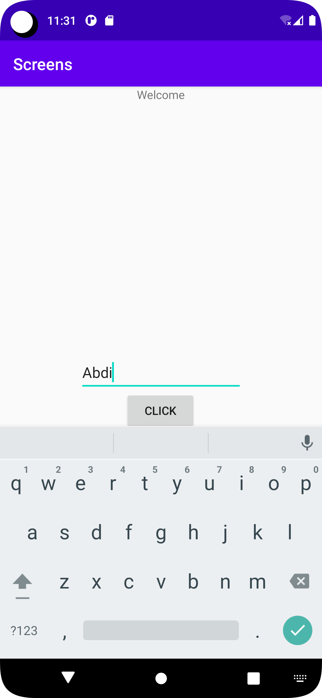
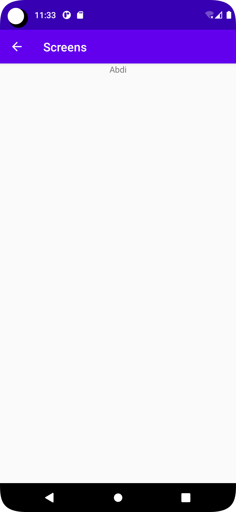

# Rapport

I MainActivity XML-koden har tre widget lagts till: TextView, EditText och Button. TextView visar en hälsningsfras "Välkommen",
EditText låter användaren ange ett namn och knappen skickar data till en annan aktivitet, "ShowActivity".

I ShowActivity XML-koden har en widget, en TextView, lagts till för att visa data som tas emot från intent.
Inten användes för att skicka data till andra aktiviteter, och Bundle användes för att skicka key-value, som "String".
Nyckeln som skickades var "String" med en datatyp. Intent underlättar överföring av data mellan aktiviteter i applikationen.

Slutligen har en funktion som liknar en pil lagts till i ShowActivity för att göra det lättare att återgå till MainActivity.


## Koden

```
Main Activity Java

public class MainActivity extends AppCompatActivity {

    @Override
    protected void onCreate(Bundle savedInstanceState) {
        super.onCreate(savedInstanceState);
        setContentView(R.layout.activity_main);

        Button sendButton = findViewById(R.id.sendButton);
        sendButton.setOnClickListener(new View.OnClickListener() {
            @Override
            public void onClick(View view) {
                Intent intent = new Intent(MainActivity.this, ShowActivity.class);

                EditText nameEdit = findViewById(R.id.editTextName);
                String name = nameEdit.getText().toString();

                intent.putExtra("name", name); // Optional
                startActivity(intent);
            }
        });
    }
}
```

```
Activity main xml

    <TextView
        android:id="@+id/textViewName"
        android:layout_width="wrap_content"
        android:layout_height="wrap_content"
        android:text="Welcome"
        app:layout_constraintStart_toStartOf="parent"
        app:layout_constraintEnd_toEndOf="parent"
        app:layout_constraintTop_toTopOf="parent"
        app:layout_constraintBottom_toTopOf="@id/textViewName"/>

    <EditText
        android:id="@+id/editTextName"
        android:layout_width="200dp"
        android:layout_height="wrap_content"
        android:minHeight="48dp"
        android:ems="10"
        android:inputType="textPersonName"
        android:text="Name"
        tools:layout_editor_absoluteX="88dp"
        tools:layout_editor_absoluteY="232dp"
        app:layout_constraintBottom_toBottomOf="parent"
        app:layout_constraintEnd_toEndOf="parent"
        app:layout_constraintHorizontal_bias="0.5"
        app:layout_constraintStart_toStartOf="parent"
        app:layout_constraintTop_toTopOf="parent"
        app:layout_constraintVertical_bias="0.5" />

    <Button
        android:id="@+id/sendButton"
        android:layout_width="wrap_content"
        android:layout_height="wrap_content"
        android:text="Click"
        app:layout_constraintBottom_toBottomOf="parent"
        app:layout_constraintEnd_toEndOf="parent"
        app:layout_constraintHorizontal_bias="0.498"
        app:layout_constraintStart_toStartOf="parent"
        app:layout_constraintTop_toTopOf="parent"
        app:layout_constraintVertical_bias="0.571" />

```

```
Nya Activity som jag döpte till Show Activity java

public class ShowActivity extends AppCompatActivity {

    @Override
    protected void onCreate(Bundle savedInstanceState) {
        super.onCreate(savedInstanceState);
        setContentView(R.layout.activity_show);

        Bundle extras = getIntent().getExtras();
        if (extras != null) {
            String name = extras.getString("name");

            // Do something with the name and number


            TextView nameView = findViewById(R.id.textViewNameShow);
            nameView.setText(name);
        }
    }
}
```

```
Show Activity xml
   <TextView
        android:id="@+id/textViewNameShow"
        android:layout_width="wrap_content"
        android:layout_height="wrap_content"
        android:text=""
        app:layout_constraintStart_toStartOf="parent"
        app:layout_constraintEnd_toEndOf="parent"
        app:layout_constraintTop_toTopOf="parent"
        app:layout_constraintBottom_toTopOf="@id/textViewNameShow"/>
```

Bilder 





